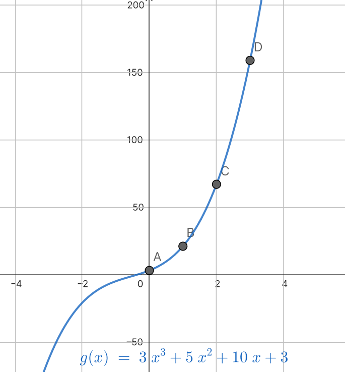
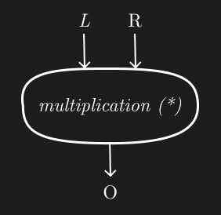
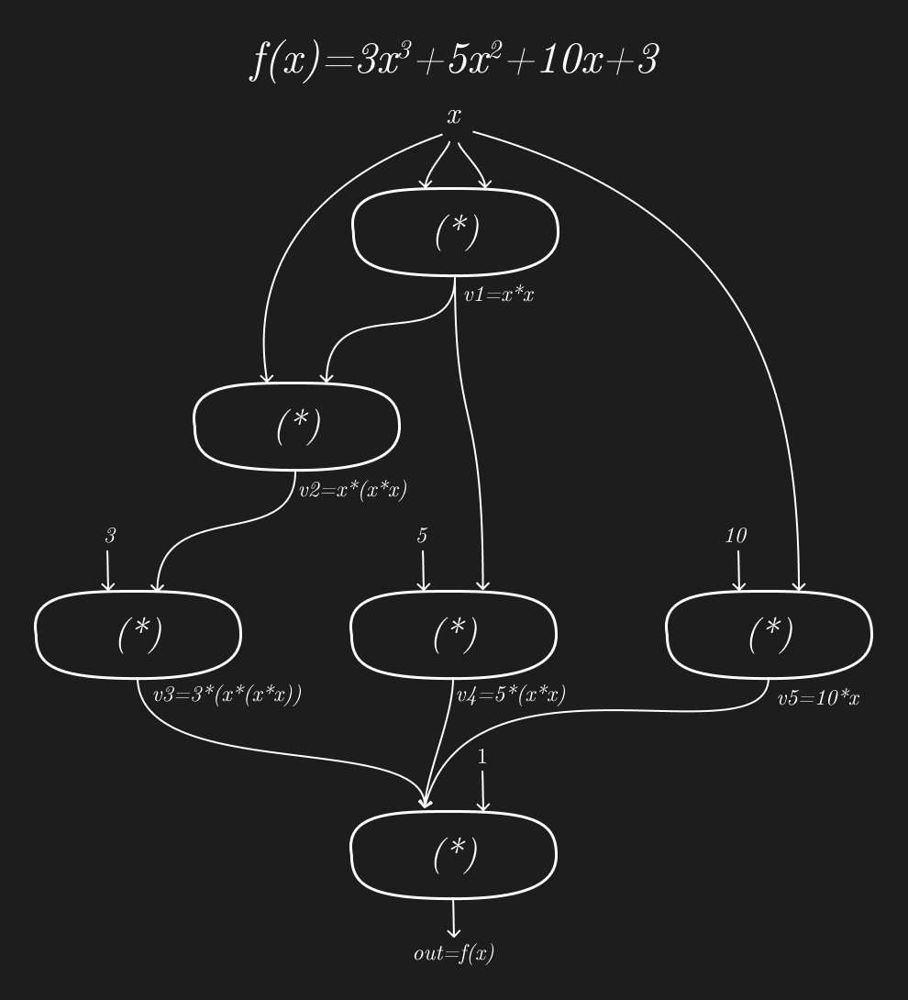
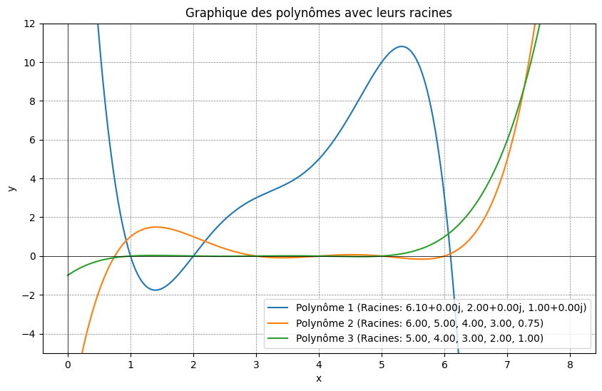
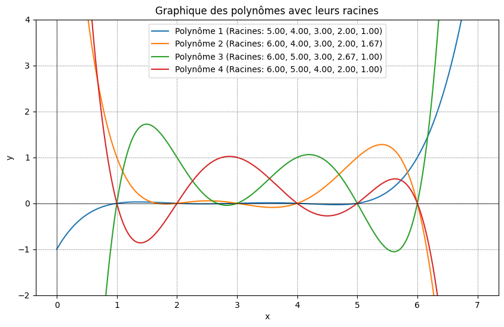
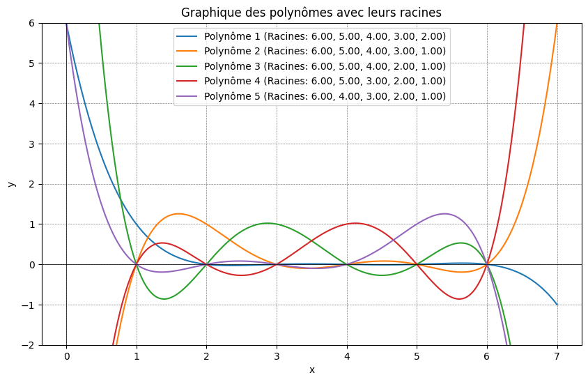

# Preuves à Divulgation Nulle de Connaissance (ZKP) : Un Outil Cryptographique Clé

Les Preuves à Divulgation Nulle de Connaissance, souvent abrégées en ZKP, représentent une avancée majeure dans le monde de la cryptographie, la science de la protection des informations. Conçues dans les années 1980 par les scientifiques Shafi Goldwasser, Silvio Micali et Charles Rackoff, les ZKP constituent une idée fascinante qui a révolutionné la manière dont les informations sécurisées sont partagées. Imaginez un jeu de devinettes où vous devez convaincre quelqu'un que vous connaissez un secret, mais sans jamais révéler le secret lui-même. C'est exactement ce que permettent les ZKP.

Dans ce jeu, vous êtes le **prouveur**, celui qui détient une information secrète, et vous cherchez à convaincre le **vérifieur**, une autre personne, de la véracité de cette information. La particularité réside dans le fait que vous réalisez cette prouesse sans jamais divulguer aucun détail sur le secret. Cela revient à prouver que vous connaissez la réponse à une énigme sans jamais la révéler.

Les ZKP fonctionnent sur la base d'un **tiers de confiance**, sorte d'arbitre neutre qui établit les règles du jeu. Ce tiers de confiance ne favorise aucun parti, mais fournit un cadre équitable et sûr pour la preuve. Ainsi, les ZKP permettent de confirmer des affirmations tout en préservant la confidentialité et la sécurité des informations.

En somme, les ZKP sont une méthode ingénieuse pour démontrer la véracité d'une affirmation sans en révéler les raisons. Devenus un élément crucial dans le domaine de la sécurité informatique, les ZKP trouvent des applications variées, allant de la protection de la vie privée en ligne à la sécurisation des transactions financières.

### Exemples simples

 Exemple 1 (Où est Charlie ?)
---------
Dans le jeu "où est Charlie ?", il faut retrouver les coordonnées d'un personnage appelé Charlie dans un dessin rempli de détails. Dans la solution de base, le **prouveur** est celui qui indique où est le personnage, le **vérifieur** peut voir sur le dessin que Charlie est au bon endroit indiqué. Le tiers de confiance peut être vu comme une personne qui garantit au vérifieur que Charlie est bien présent quelque part sur l'image ou que l'image n'a pas été remplacée.

Dans une approche ZKP, le **prouveur** peut montrer au **vérifieur** qu'il sait où se trouve Charlie sans divulguer sa position.

Pour cela, il recouvre l'image d'un cache noir largement plus grand que le dessin. Dans ce cache, un petit trou est découpé, juste assez grand pour montrer Charlie, mais rien d'autre. Ce trou est soigneusement positionné de sorte qu'il révèle uniquement le personnage de Charlie dans l'image. Ce faisant, le cache cache efficacement tout le reste de l'image, y compris les coordonnées exactes où Charlie se trouve.

Le vérifieur, alors, est en mesure de voir Charlie à travers ce trou, confirmant ainsi que Charlie est bien présent dans l'image. Cependant, et c'est là que réside l'astuce, le vérifieur ne peut pas déterminer l'emplacement exact de Charlie dans l'image. Il voit bien Charlie, mais les coordonnées précises restent un mystère.

Ainsi, lorsque le vérifieur quitte la scène, il est convaincu que le prouveur a effectivement localisé Charlie, mais sans avoir lui-même accès à cette information spécifique. La position de Charlie reste secrète, et c'est là que réside la beauté des ZKP : prouver une affirmation (Charlie est trouvé) sans divulguer les informations critiques (où exactement Charlie se trouve dans l'image).

Exemple 2 (Résolution de sudoku)
---------
Le sudoku est un puzzle captivant qui met au défi les joueurs de remplir une grille de 9x9 cases avec des chiffres allant de 1 à 9. Cette grille est subdivisée en 9 blocs carrés, chacun mesurant 3x3 cases. Pour résoudre le puzzle, chaque ligne, chaque colonne, et chaque bloc carré de 9 cases doivent contenir tous les chiffres de 1 à 9, sans répétitions.

Au début du jeu, certaines cases de la grille sont déjà remplies avec des chiffres. Ces indices initiaux sont placés de manière stratégique pour guider le joueur vers une solution unique. L'objectif du joueur est donc de compléter les 27 groupes de la grille – 9 lignes, 9 colonnes, et 9 blocs – en veillant à ce que chaque groupe contienne tous les chiffres de 1 à 9, une seule fois.

Dans la version classique du jeu, le rôle du **prouveur** revient au joueur qui démontre que la grille a été correctement remplie, en s'assurant que chaque chiffre est bien placé selon les règles.

Dans une approche ZKP, le **prouveur** peut montrer au **vérifieur** qu'il connait la solution sans divulguer la répartition des chiffres.

Pour appliquer la méthode des Preuves à Divulgation Nulle de Connaissance (ZKP) au sudoku, le prouveur adopte une approche unique. Au lieu d'inscrire directement les solutions sur la grille, il utilise des étiquettes amovibles qu'il place sur les cases vides. Chaque étiquette porte la valeur correcte pour sa case respective, mais ces étiquettes sont disposées face cachée, de sorte que le vérifieur ne peut pas voir les valeurs.

Pour mener à bien la démonstration ZKP, le vérifieur interroge le prouveur à travers un ensemble de 18 questions spécifiques. Chaque question cible un ensemble d'étiquettes correspondant à une zone particulière de la grille de sudoku - soit une ligne, une colonne, ou un bloc de 3x3. En réponse, le prouveur recueille les étiquettes de la zone concernée, les mélange à l'abri des regards du vérifieur, puis révèle que chaque chiffre de 1 à 9 est présent une seule fois parmi ces étiquettes, sans toutefois divulguer leur arrangement spécifique. Après cette démonstration, il replace les étiquettes face cachée à leurs emplacements originaux.

En répétant ce processus pour les 18 questions couvrant ainsi toutes les lignes, colonnes et blocs de la grille, le vérifieur devient progressivement convaincu que le prouveur connaît effectivement la solution complète de la grille de sudoku. Cependant, malgré cette conviction, le vérifieur demeure dans l'ignorance quant à la disposition précise des valeurs sur la grille. Ainsi, la méthode ZKP est mise en œuvre avec succès : le prouveur démontre sa connaissance de la solution sans divulguer les détails spécifiques de cette dernière.

Cette preuve est dite interactive, car elle peut se terminer avant la fin des 18 itérations. En effet, au fur et à mesure des itérations, le vérifier devient de plus en plus convaincu que le prouver a bien résolu la grille.

Ces deux exemples donnent une intuition sur le principe de fonctionnement des approches par ZKP. Dans le cadre général, il s'agit d'arriver à montrer qu'on connait la réponse à une question en révélant des valeurs qui n'ont pas de corrélation directe avec la solution. "Charlie est là, mais je n'ai pas sa coordonnée", "les chiffres sont là, mais je n'ai pas vu l'organisation".

Il existe de nombreux exemples plus ou moins intuitifs sur les mécanismes de ZKP. Dans le domaine de la crypto, les techniques tournent autour de la résolution de polynômes de degrés n. Le principe est de montrer qu'on connait la solution d'un système d'équations sachant que la complexité du système rend improbable le fait de trouver la solution par tirage aléatoire.

### Overview
Dans le vaste domaine des Preuves à Divulgation Nulle de Connaissance (ZKP), certaines avancées technologiques clés ont émergé pour répondre à des besoins spécifiques de performance et de transparence. Parmi ces innovations, les concepts de ZKP succincts, non-interactifs et transparents se distinguent par leurs caractéristiques uniques et leur applicabilité dans divers contextes.

Les **ZKP succincts** révolutionnent l'efficacité en générant des preuves de taille extrêmement réduite. Cette caractéristique est cruciale pour les applications nécessitant un traitement et une vérification rapides, même pour des affirmations complexes. L'atout principal de ces ZKP est leur capacité à réduire considérablement l'espace de stockage et le temps de traitement, rendant ainsi possible leur utilisation dans des systèmes à grande échelle ou des environnements avec des ressources limitées.

D'autre part, les **ZKP non-interactifs** simplifient le processus de vérification. Contrairement aux ZKP interactifs, où une série de communications entre le prouveur et le vérifieur est nécessaire, les ZKP non-interactifs permettent au prouveur de produire une preuve unique que n'importe quel vérifieur peut ensuite confirmer sans interaction supplémentaire. Cette propriété les rend particulièrement adaptés pour les applications décentralisées, telles que les blockchains et les cryptomonnaies, où l'interaction directe n'est pas toujours possible ou souhaitable.

Enfin, les **ZKP transparents** abordent les préoccupations en matière de confiance et de sécurité. Ils éliminent le besoin d'une configuration secrète, un processus souvent nécessaire dans les systèmes de preuves classiques. En rendant le processus de génération de preuves entièrement transparent, ces ZKP renforcent la confiance dans leur validité et réduisent le risque de manipulation ou d'erreur.

### zk-SNARK
Les zk-SNARKs sont des preuves à divulgation nulle de connaissance succinctes et non interactives. Pour rappel, non-interactif, veut dire que la preuve est validée en un seul échange, succcincte veut dire que le temps de calcul pour le **vérifieur** doit être rapide. Groth16 est un implantation du protocole zk-SNARK et nous proposons ici de présenter le fonctionnement général et justifier les différentes étapes. Nous expliquerons cela sans faire appel à de trop grandes notions théoriques mathématiques, tout en illustrant de lignes de code les exemples les plus importants.

Nous donnons en annexe une liste de lecture permettant de rentrer plus facilement dans certains détails. Ce document est fortement inspiré de deux sources.

Notre objectif étant que le protocole soit compréhensible dans cette première lecture.

Dans zkSnarks, la preuve sans divulgation consiste à indiquer à un vérifier qu'on connait un polynôme sans divulguer l'équation du polynome. Partons du polynôme : $f(x) = 3x^3+5x^2+10x+3$ que seul le **prouveur** connait.

La question est la suivante, en tant que **prouveur** "Comment prouver à une personne que je connais ce polynôme ? " sans lui indiquer les coefficients (3, 5, 10, 3) ni les degrés correspondants.



Lorsque je présente au **vérifieur** des paires de valeurs telles que (0, 3), (1, 21), (2, 67) et (3, 159), il peut en déduire que je suis au courant de l'existence d'une courbe spécifique de degré 3, puisqu'une seule courbe de ce type peut relier ces quatre points. Cependant, ce processus comporte un risque : le vérifieur pourrait potentiellement retrouver la courbe originale à partir de ces informations, ce qui compromettrait l'objectif de cacher la courbe. D'un autre côté, il est aussi possible que j'aie fabriqué ces points sans fondement réel.

Nous sommes donc confrontés à deux défis majeurs en maintenant la méthode de révélation de certaines coordonnées : premièrement, démontrer ma connaissance du polynôme sans pour autant divulguer ses coefficients spécifiques, permettant ainsi au **vérifieur** de confirmer l'existence d'une courbe correspondante. Deuxièmement, il est crucial de dissimuler ces informations de manière à empêcher le vérifieur de remonter au polynôme d'origine, tout en garantissant que le masquage ne me donne pas la latitude de sélectionner des valeurs aléatoires.

Le premier challenge, consiste à transformer l'équation vers un ensemble de polynomes uniques qui possèdent la même solution que le polynme initial. Le polynôme initial est transformé dans un système d'équations qui présente le même ensemble de solutions que le polynôme initial, mais qui rend fortement improbable de remonter au polynôme source.

Cette transformation se fait en trois étapes :
  1. Transformation du polynôme initial dans un circuit R1CS
  2. Transformation du circuit en coefficients d'un système de courbe quadratique
  3. Extension du système de courbes quadratiques pour équilibrer les équations

# Circuit R1CS
Le Circuit R1CS, ou Rank 1 Constraint System, est une structure clé en cryptographie, utilisée pour transformer des équations polynomiales complexes en une série d'opérations élémentaires axées sur la multiplication, avec deux entrées et une sortie:

<p align="center">
  
</p>

Cette transformation est essentielle pour simplifier le traitement des équations dans des contextes tels que les preuves à divulgation nulle de connaissance.

Considérons un exemple concret avec notre polynôme $f(x) = 3x^3 + 5x^2 + 10x + 3$. Sa conversion en circuit R1CS se décompose en étapes successives, où chaque opération polynomiale est transformée en une série de multiplications:
```
v1 = x * x   (1)  
v2 = x * v1  (2)  
v3 = 3 * v2  (3)  
v4 = 5 * v1  (4)  
v5 = 10 * x  (5)  
out = v3 + v4 + v5 + 3 (6)  
out = (v3 + v4 + v5 + 3) * 1 (6bis)  
```
Le schéma suivant présente le circuit équivalent sous forme de portes. 



Dans le circuit R1CS, chaque étape est représentée par une porte logique, intégrant des entrées et une sortie basées sur la multiplication. Pour s'aligner avec les contraintes du circuit, les additions sont traitées en regroupant les signaux en amont des portes. Ainsi, la dernière étape où `out` est calculé devient une multiplication par 1 pour respecter la forme standard du R1CS : $O = L * R$.

Le circuit est ensuite exprimé sous forme de trois matrices distinctes, correspondant aux éléments gauche (L), droite (R) et sortie (O) du circuit. Ces matrices détaillent comment chaque variable et chaque étape intermédiaire sont reliées entre elles dans le circuit. Les colonnes de la matrice sont donc `[ 1 out x v1 v2 v3 v4 v5 ]`.  
Le système d'équation se résume à 3 matrices, dont le résultat fourni la sortie finale : `L * R = O`

```
//L    
//1 out x v1 v2 v3 v4 v5  
[  
  0  0  1  0  0  0  0  0    // x  
  0  0  1  0  0  0  0  0    // x  
  3  0  0  0  0  0  0  0    // 3  
  5  0  0  0  0  0  0  0    // 5  
 10  0  0  0  0  0  0  0    // 10  
  3  0  0  0  0  1  1  1    // (6bis)  
]
```

```
//R  
//1 out x v1 v2 v3 v4 v5  
[  
  0  0  1  0  0  0  0  0  // x  
  0  0  0  1  0  0  0  0  // v1  
  0  0  0  0  1  0  0  0  // v2  
  0  0  0  1  0  0  0  0  // v1  
  0  0  1  0  0  0  0  0  // x  
  1  0  0  0  0  0  0  0  // (6bis)  
]
```

```
//out  
//1 out x v1 v2 v3 v4 v5  
[  
  0  0  0  1  0  0  0  0    // v1  
  0  0  0  0  1  0  0  0    // v2  
  0  0  0  0  0  1  0  0    // v3   
  0  0  0  0  0  0  1  0    // v4  
  0  0  0  0  0  0  0  1    // v5  
  0  1  0  0  0  0  0  0    // out  
]  
```

Le cœur de ce système réside dans le vecteur témoin, qui est une représentation concrète des valeurs calculées à chaque étape. Pour une valeur donnée de `x`, par exemple `x = 5`, le vecteur témoin est calculé et contient toutes les valeurs intermédiaires et finales du circuit. Ce vecteur est crucial pour la vérification, car il démontre au **vérifieur** que le prouveur connaît une solution sans révéler explicitement les détails de cette solution.

`w = [ 1 out x v1 v2 v3 v4 v5]` on peut prendre n'importe quelle valeur de x, et calculer alors toutes les autres valeurs. Si `x = 5` alors on aura comme vecteur témoins les valeurs suivantes :  `w = [ 1 553 5 25 125 375 125 50]`  
  
  
`Lw * Rw = Ow`  
  
Que l'on peut vérifier avec le code python suivant [code/r1cs.py](code/r1cs.py) :
```python
import numpy as np
import random

# Define the matrices
O = np.array([
[0,0,0,1,0,0,0,0],
[0,0,0,0,1,0,0,0],
[0,0,0,0,0,1,0,0],
[0,0,0,0,0,0,1,0],
[0,0,0,0,0,0,0,1],
[0,1,0,0,0,0,0,0]
])

L = np.array([
[ 0,0,1,0,0,0,0,0],
[ 0,0,1,0,0,0,0,0],
[ 3,0,0,0,0,0,0,0],
[ 5,0,0,0,0,0,0,0],
[10,0,0,0,0,0,0,0],
[ 3,0,0,0,0,1,1,1]
])

R = np.array([
[0,0,1,0,0,0,0,0],
[0,0,0,1,0,0,0,0],
[0,0,0,0,1,0,0,0],
[0,0,0,1,0,0,0,0],
[0,0,1,0,0,0,0,0],
[1,0,0,0,0,0,0,0]
])

# pick random values for x and y
x = random.randint(1,1000)
#x = 5

# this is our orignal formula
v1 = x * x
v2 = x * v1
v3 = 3 * v2
v4 = 5 * v1
v5 = 10 * x
out = v3 + v4 + v5 + 3

w = np.array([1, out, x, v1, v2, v3, v4, v5])

result = O.dot(w) == np.multiply(L.dot(w),R.dot(w))
assert result.all(), "result contains an inequality"

print("-->", w)
```

Ces matrices ne font que représenter le polynôme initial en le décomposant en une multiplication de matrice. Le polynôme va maintenant être masqué dans un système d'équation quadratiques, constitué d'autant de courbes quadratique que de paramètres de l'équation, et pour lesquels le degré max des équations correspondes au nombre le ligne des matrices.

Dans notre exemple, le système d'équation quadrique sera composé de 8 équations de 6e degré.

## Une vérification intermédiaire rapide
Une première vérification consiste à vérifier que les matrices représentant le circuit résolvent le vecteur témoin. L'application est un produit d'Hadamard entre les matrice L, R et O et le vecteur comme illustré ci-dessous. Les valeurs du vecteur sont répliqués sur chaque colonne de la matrice.

Lw . Rw = Ow

```
L.w =
  0  0  1  0  0  0  0  0           1
  0  0  1  0  0  0  0  0         553
  3  0  0  0  0  0  0  0    .      5
  5  0  0  0  0  0  0  0          25
 10  0  0  0  0  0  0  0         125
  3  0  0  0  0  1  1  1         375
                                 125
                                  50

==> L.w
 0 * 1     0 * 553   1 * 5   0 * 25   0 * 125  0 * 375  0 * 125   0 * 50
 0 * 1     0 * 553   1 * 5   0 * 25   0 * 125  0 * 375  0 * 125   0 * 50
 3 * 1  +  0 * 553 + 0 * 5 + 0 * 25 + 0 * 125+ 0 * 375+ 0 * 125 + 0 * 50
 5 * 1     0 * 553   0 * 5   0 * 25   0 * 125  0 * 375  0 * 125   0 * 50
10 * 1     0 * 553   0 * 5   0 * 25   0 * 125  0 * 375  0 * 125   0 * 50
 3 * 1     0 * 553   0 * 5   0 * 25   0 * 125  1 * 375  1 * 125   1 * 50

==> L.w
   5
   5
   3
   5
  10
 553

==> R.w
0 * 1   0 * 553   1 * 5   0 * 25   0 * 125   0 * 375   0 * 125   0 * 50
0 * 1   0 * 553   0 * 5   1 * 25   0 * 125   0 * 375   0 * 125   0 * 50
0 * 1 + 0 * 553 + 0 * 5 + 0 * 25 + 1 * 125 + 0 * 375 + 0 * 125 + 0 * 50
0 * 1   0 * 553   0 * 5   1 * 25   0 * 125   0 * 375   0 * 125   0 * 50
0 * 1   0 * 553   1 * 5   0 * 25   0 * 125   0 * 375   0 * 125   0 * 50
1 * 1   0 * 553   0 * 5   0 * 25   0 * 125   0 * 375   0 * 125   0 * 50

==> R.w
  5
 25
125
 25
  5
  1

==> O.w
0 * 1   0 * 553   0 * 5   1 * 25   0 * 125   0 * 375   0 * 125   0 * 50
0 * 1   0 * 553   0 * 5   0 * 25   1 * 125   0 * 375   0 * 125   0 * 50
0 * 1 + 0 * 553 + 0 * 5 + 0 * 25 + 0 * 125 + 1 * 375 + 0 * 125 + 0 * 50
0 * 1   0 * 553   0 * 5   0 * 25   0 * 125   0 * 375   1 * 125   0 * 50
0 * 1   0 * 553   0 * 5   0 * 25   0 * 125   0 * 375   0 * 125   1 * 50
0 * 1   1 * 553   0 * 5   0 * 25   0 * 125   0 * 375   0 * 125   0 * 50

==> O.w
 25
125
375
125
 50
553
```

On peut facilement vérifier que Lw x Rw = Ow.

# Le twist des équations quadratiques
Cette dernière multiplication fonctionne, mais il est simple de comprendre que si on connait les valeur de la matrice et le vecteur solution on peut remonter au circuit initial. Le premier vrai masqage va consister a faire la même multiplication mais dans le monde des Polynomes en "noyant" les coefficients des matrices dans une série d'équations quadratiques.

Si on prend la première série de coefficient de la matrice L, on a les valeurs : `(0, 0, 3, 5, 10, 3)`, ce sont les coefficients d'entrée aux portes du circuit. Si ces coefficients sont vus comme des coordonnées de l'espace plan : $[(1,0), (2,0), (3, 3), (4, 5), (5, 10), (6, 3)]$.

On sait qu'il existe une seule courbe de dimension 6 qui passe par ces 6 points. Elle a la forme $f(x) = a5x^5+a4x^4+a3x^3+a2x^2+a1x+a0$ , et que grâce à Lagrange on peut lui faire calculer les coefficient pour passer par les points. On passe alors dans l'espace du signal, et l'ensemble des fonctions de tous les coefficients de passage des portes forme un système d'équations. Ce système d'équations est résolu par une convolution avec le vecteur témoin.

Pour obtenir le système, il faut fabriquer les polynomes de lagrange correspondant.

Le code suivant permet d'obtenir les coefficients des polynômes de Lagrange [code/lagrange.py](code/lagrange.py)

```python
import numpy as np
from scipy.interpolate import lagrange
x = np.array([1, 2, 3, 4, 5, 6])
y = np.array([0, 0, 3, 5, 10, 3])
print(lagrange(x, 1))
```

```
U : Transposé et coordonnées           --> Polynôme (on n'indique que les polynômes différents de 0)

(1,0) (2,0) (3,3) (4,5) (5,10) (6,3)   --> f(x) = -0.225x^5 +3.708x^4 -23.12x^3 +67.79x^2 -90.15x +42
(1,0) (2,0) (3,0) (4,0)  (5,0) (6,0)   --> 0
(1,1) (2,1) (3,0) (4,0)  (5,0) (6,0)   --> f(x) = 0.03333x^5 -0.625x^4 +4.417x^3 -14.38x^2 +20.55x -9
(1,0) (2,0) (3,0) (4,0)  (5,0) (6,0)   --> 0
(1,0) (2,0) (3,0) (4,0)  (5,0) (6,0)   --> 0
(1,0) (2,0) (3,0) (4,0)  (5,0) (6,1)   --> f(x) = 0.008333x^5 -0.125x^4 +0.7083x^3 -1.875x^2 + 2.283x -1
(1,0) (2,0) (3,0) (4,0)  (5,0) (6,1)   --> f(x) = idem U[5]
(1,0) (2,0) (3,0) (4,0)  (5,0) (6,1)   --> f(x) = idem U[5]

V : Transposé et coordonnées           --> Polynôme (on n'indique que les polynômes différents de 0)
(1,0) (2,0) (3,0) (4,0) (5,0) (6,1)    --> f(x) = idem U[5]
(1,0) (2,0) (3,0) (4,0) (5,0) (6,0)    --> 0
(1,1) (2,0) (3,0) (4,0) (5,1) (6,0)    --> f(x) = -0.05x^5 +0.8333x^4 -5.25x^3 +15.67x^2 -22.2x +12
(1,0) (2,1) (3,0) (4,1) (5,0) (6,0)    --> f(x) = 0.125x^5 -2.208x^4 +14.62x^3 -44.79x^2 +62.25x -30
(1,0) (2,0) (3,1) (4,0) (5,0) (6,0)    --> f(x) = -0.08333x^5 +1.5x^4 -10.08x^3 +31x^2 -42.33x +20
(1,0) (2,0) (3,0) (4,0) (5,0) (6,0)    --> 0
(1,0) (2,0) (3,0) (4,0) (5,0) (6,0)    --> 0
(1,0) (2,0) (3,0) (4,0) (5,0) (6,0)    --> 0

W : Transposé et coordonnées           --> Polynôme (on n'indique que les polynômes différents de 0)
(1,0) (2,0) (3,0) (4,0) (5,0) (6,0)   --> 0
(1,0) (2,0) (3,0) (4,0) (5,0) (6,1)   --> f(x) = idem U[5]
(1,0) (2,0) (3,0) (4,0) (5,0) (6,0)   --> 0
(1,0) (2,0) (3,0) (4,0) (5,0) (6,0)   --> f(x) = -0.008333x^5+0.1667x^4-1.292x^3+4.833x^2-8.7x+6
(1,0) (2,1) (3,0) (4,0) (5,0) (6,0)   --> f(x) = 0.04167x^5-0.7917x^4+5.708x^3-19.21x^2+29.25x-15
(1,0) (2,0) (3,1) (4,0) (5,0) (6,0)   --> f(x) = idem à V[4]
(1,0) (2,0) (3,0) (4,1) (5,0) (6,0)   --> f(x) = 0.08333x^5-1.417x^4+8.917x^3-25.58x^2+33x-15
(1,0) (2,0) (3,0) (4,0) (5,1) (6,0)   --> f(x) = -0.04167x^5+0.6667x^4-3.958x^3+10.83x2-13.5x+6
```

Nous obtenons 3 matrices de coefficients de Lagrange. Le nombre de fonctions, représenté par les lignes représentent le nombre de paramètres utilisés dans le circuit, le degré des polynomes correspond au nombre d'opérations du circuit (un degré 5, véhicule 6 opérations). Dans notre exemple 8 variables de circuit pour 6 opérations.

Nous récrivons ces polynomes sous la forme de matrices (de coefficients) que nous pouvons multiplier avec le vecteur solution, afin de vérifier la même preuve que précédemment mais dans l'espace des polynômes.
`Uw . Vw = Ww`

`w = [ 1 553 5 25 125 375 125 50]`
```
U:
[
 [ -0.225, 0,  0.033, 0, 0,  0.008,  0.008,  0.008]
 [  3.708, 0, -0.625, 0, 0, -0.125, -0.125, -0.125]
 [-23.125, 0,  4.417, 0, 0,  0.708,  0.708,  0.708]
 [ 67.792, 0,-14.375, 0, 0, -1.875, -1.875, -1.875]
 [-90.15 , 0, 20.55 , 0, 0,  2.283,  2.283,  2.283]
 [ 42    , 0, -9.   , 0, 0, -1    , -1    , -1   ]
]
```

$Uw(x) = 4.525x^5-68.17x^4+388.5x^3-1035x^2+1268x-553$

```
V:
[
 [ 0.008, 0,  -0.05 ,   0.125,  -0.083, 0, 0, 0]
 [-0.125, 0,   0.833,  -2.208,   1.5  , 0, 0, 0]
 [ 0.708, 0,  -5.25 ,  14.625, -10.083, 0, 0, 0]
 [-1.875, 0,  15.667, -44.792,  31    , 0, 0, 0]
 [ 2.283, 0, -22.2  ,  62.25 , -42.333, 0, 0, 0]
 [-1    , 0,  12    , -30    ,  20    , 0, 0, 0]
]
```

$Vw(x) = -7.492x^5+136.3x^4-920.3x^3+2832x^2-3844x+1809$

```
W:
[
 [0,  0.008, 0, -0.008,   0.042,  -0.083,   0.083, -0.042]
 [0, -0.125, 0,  0.167,  -0.792,   1.5  ,  -1.417,  0.667]
 [0,  0.708, 0, -1.292,   5.708, -10.083,   8.917, -3.958]
 [0, -1.875, 0,  4.833, -19.208,  31    , -25.583, 10.833]
 [0,  2.283, 0, -8.7  ,  29.25 , -42.333,  33    , 13.5  ]
 [0, -1    , 0,  6    , -15    ,  20    , -15    ,  6    ]
]
```

$Ww(x) = -13.31x^5+254.8x^4-1792x^3+5652x^2-7724x+3647$

*Attention les polynômes Uw, Vw, Ww indiqués ici sont arrondis par les affichages. Les erreurs d'arrondis peuvent faire dévier fortement les courbes...*

La multiplication de la matrice de Lagrange par le vecteur témoin se fait par le code python suivant [code/mult.py](code/mult.py)
```python
import numpy as np
from numpy import poly1d

V = np.array(
[[  0.008, 0,  -0.05 ,   0.125,  -0.083, 0, 0, 0],
 [ -0.125, 0,   0.833,  -2.208,   1.5  , 0, 0, 0],
 [  0.708, 0,  -5.25 ,  14.625, -10.083, 0, 0, 0],
 [ -1.875, 0,  15.667, -44.792,  31    , 0, 0, 0],
 [  2.283, 0, -22.2  ,  62.25 , -42.333, 0, 0, 0],
 [ -1,     0,  12    , -30    ,  20    , 0, 0, 0]])

witness = [1, 553, 5, 25, 125, 375, 125, 50]

Vw = np.matmul(V, witness)
print(poly1d(Vw))
```
# L'application de la preuve
Si l'isomorphisme fonctionne, nous pouvons faire l'opération de controle. Dans le monde R1CS nous avons vérifié que `Lw . Rw = Ow`. Nous devrions avoir par similitude dans le domaine des Polynômes : `Uw * Vw = Ww`.  

On peut constater un problème sur les degrés des polynômes. La multiplication des Polynômes Uw par Vw va nécessairement aboutir sur un polynôme de degré 10. Il faut donc annuler les degrés supérieurs au degré de Ww. Cela se fait par une polynome de degré `deg(Uw * Vw) - deg(Ww)`.  
$H(x) = (x-1)(x-2)(x-3)...(x-10)$

`Uw * Vw = Ww + H`
Le polynome H n'a aucune chance d'annuler l'innégalité, car il est choisi de manière arbitraire.  
`(Uw * Vw) - Ww != H`  

L'idée est de décomposer le polynôme H, en réduisant sa dimension pour avoir 2 termes dont un est connu h et l'autre ne fait qu'annuler l'équation.
`(Uw * Vw) - Ww = h * t`  

`h * t` doit être de la dimension de `(Uw * Vw)`, t peut être fabriqué commme voulu. On peut donc écrire l'équation suivante :
`((Uw * Vw) - Ww) / t = h`

Si `t` est un diviseur parfait de `((Uw * Vw) - Ww)` alors l'équation Qap fonctionne et nous avons la preuve qu'on connait le polynome initial.  
$f(x)=3x^3+5x^2+10x+3$.

En effet la probabilité de connaître un polynôme unique qui relie les signaux `U, V, et W` par un diviseur cible `t` est nulle. Vous pouvez donc vérifier cette proposition en vérifiant que le reste de la division est nul.

Dans notre exemple, [code/division.py](code/division.py), le code python suivant, indique un reste proche de 0 qu'on peut considérer nul.
```python
import numpy as np
from numpy import poly1d

Uw = poly1d([4.525,-68.16666667,388.54166667,-1035.33333333,1268.43333333,-553])
Vw = poly1d([-7.53333333,136.33333333,-920.33333333,2831.66666667,-3844.13333333,1809])
Ww = poly1d([-13.30833333,254.83333333,-1791.625,5651.66666667,-7723.56666667,3647])

t = poly1d([1, -1])*poly1d([1, -2])*poly1d([1, -3])*poly1d([1, -4])*poly1d([1, -5])*poly1d([1, -6])

(h, reste) = ((Uw * Vw)-Ww)/t

print("h \n", h)
print("reste \n", reste)
```
$h(x)=-34.09x^4+414.6x^3-1713x^2+2734x-1394$
$r(x)=0.0001015x^5-0.001524x^4+0.00865x^3-0.02295x^2+0.028x-0.01228$

A titre de comparaison la fonction résultante ((Uw*Vw)-Ww) est la suivante  
$f(x)=-34.09x^{10}+1130x^9-16380x^8+136300x^7-718700x^6+2500000x^5-5792000x^4+8785000x^3-8321000x^2+4428000x-1004000$

Le soucis majeur du système dans l'état où il se trouve est qu'il n'est pas succinct. Si on réalise un circuit complexe le système d'équation va devenir rapidement incalculable pour le **prouveur** et le **vérifieur**.
L'étape suivante consiste à porter nos équations dans un espace de calcul plus efficace. Passer sur de l'arithmétique modulaire et projeter les données dans l'espace des courbes elliptiques simplifiera les calculs.

# L'espace de galois
Tous les calculs peuvent se faire dans un espace de galois. C'est à dire un environnement où toutes nos équations seront exprimées en modulo d'une valeur d'un nombre premier appélé ordre. Par exemple, si on choisi l'espace de Galois de valeur 7, la matrice L et le vecteur témoins sont modifiés en conséquence. En python, ils doivent être rendus compatibles avant d'être convertis en valeurs appartenant au corps associé. Le code suivant [code/qapGF.py](code/qapGF.py) indique la même preuve que précédemment mais dans le corps de galois d'ordre 7. 
Nous utilisons deux fonctions spécifiques : `calculPolyLagrangeGF` calcul les coefficients de lagrange dans le le corps et `generateT` qui fabrique le polynôme d'annulation de la puissance. 

```python
import sys
import numpy as np
import galois

def calculPolyLagrangeGF(array):
    (horizontal, vertical) = array.shape

    x = GF(np.arange(1, horizontal+1)) # x = [1, 2, 3, 4]

    tL = np.transpose(array)
    res = GF(np.zeros((vertical, horizontal), dtype=int))

    for i in range(vertical):
        r = galois.lagrange_poly(x,tL[i])
        res[i] = r.coefficients()

    return(np.transpose(res))

def generateT(size, ordre):
    '''
    (6) = (x-1)(x-2)(x-3)(x-4)(x-5)(x-6)
    '''
    result_poly = galois.Poly([1], field=ordre)  # Start with the polynomial '1' in the given field
    for val in range(1, size+1):
        # Multiply the result by (x - val) for each val in values
        result_poly *= galois.Poly([1, -val], field=ordre)
    return result_poly 

p=7
GF = galois.GF(p) 

np.set_printoptions(linewidth=np.nan)

#On part des matrices initiales. Indépendantes du corps de calcul
L = GF(np.array([
 [0,0,1,0,0,0,0,0],
 [0,0,1,0,0,0,0,0],
 [3,0,0,0,0,0,0,0],
 [5,0,0,0,0,0,0,0],
[10,0,0,0,0,0,0,0],
 [3,0,0,0,0,1,1,1]
]) % p)

R = GF(np.array([
[0,0,1,0,0,0,0,0],
[0,0,0,1,0,0,0,0],
[0,0,0,0,1,0,0,0],
[0,0,0,1,0,0,0,0],
[0,0,1,0,0,0,0,0],
[1,0,0,0,0,0,0,0]
]) % p)

O = GF(np.array([
[0,0,0,1,0,0,0,0],
[0,0,0,0,1,0,0,0],
[0,0,0,0,0,1,0,0],
[0,0,0,0,0,0,1,0],
[0,0,0,0,0,0,0,1],
[0,1,0,0,0,0,0,0]
]) % p)

witness = [1, 553, 5, 25, 125, 375, 125, 50]
witness = np.array(witness) % p
witness = GF(witness)

U_polys = calculPolyLagrangeGF(L)
V_polys = calculPolyLagrangeGF(R)
W_polys = calculPolyLagrangeGF(O)

Uw = galois.Poly(np.matmul(U_polys, witness))
Vw = galois.Poly(np.matmul(V_polys, witness))
Ww = galois.Poly(np.matmul(W_polys, witness))

t = generateT(len(L), GF)

h_quo = (Uw * Vw - Ww) // t
h_rem = (Uw * Vw - Ww) % t

print("t(x) = ", t,"\n")
print("\nh_quo(x) = ", h_quo)
print("h_rem(x) = ", h_rem)
if(h_rem == 0):
    print("=> La preuve est valide")
else:
    print("=> La preuve invalide")
```

Le passage dans le corps de Galois ne permet pas nécessairement de gagner du temps de calcul, mais permet de projetter les équation sur des courbes elliptique afin de fournir une preuve plus succincte, ainsi que d'obtenir le reste de la division `h_hem` égale à 0 car nous ne travaillons plus avec des nombres flottants donc il n'y a plus de problème d'arrondit. 

# Projection sur les courbes elliptiques
Dans la preuve précédente, le **prouveur** montre au **vérifieur** les trois polynomes Uw, Vw, Ww, ainsi que le degré des équations. 
Le **vérifieur** peut fabriquer le polynôme *t*, et vérifier que la division est sans reste. Mais le **vérifieur** accède quand même à ces polynômes qu'il peut alors donner à autre et se faire passer pour un **prouveur**. 

Pour palier cela, **prouveur** et **verifieur** sont mis en relation par un tier de confiance le **confident** *Trusted setup* en anglais, qui va imposer des valeurs de références uniques au deux participants. 

Le principe est le suivant. On part de l'équation : 
$Uw * Vw = Ww + HT$

Ce sont tous des polynômes, qui peuvent être évalués à n'importe quelle coordonnée. 

Prenons par-exemple Uw = $4x^5 + 3x^4 + 5x^3 + 3x^2 - 4x$
En choisissant arbitrairement `x = 5`, on peut écire `4x^5 + 3x^4 + 5x^3 + 3x^2 - 4x = 15055`
Une courbe elliptique permet de fournir une valeur représentante qui montre que la solution est connue mais sans qu'on puisse remonter à l'équation source. (C'est une forme de Zkp, mais sans vérification possible).
$Ell(Uw(5)) = 4*Ell(5^5) + 3*Ell(5^4) + 5*Ell(5^3) + 3*Ell(5^2)-4*Elli(5)+0$

Les courbes elliptiques fonctionnent ainsi : 
On part d'un point sur la courbe, appelé G. En fonction des courbes considérés les points initiaux peuvent avoir plusieurs types de coordonnées. G1 : 1 point à 2 dimensions, G2 : 2 points à 2 dimensions, G12 : 12 points à 2 dimensions.
Si on ajoute G à G, on trouve le point suivant sur la courbe. 5*G1 déplace G1 sur la courbe de 5 sauts, et 5G1 est toujours sur la courbe. 
Par rapport à notre exemple : 
$15055G1 = 4*3125G1 + 3*625G1 + 5*125G1 + 3*25G1 - 4*5G1$
$15055G1 = 15055G1$
Le code python [code/G.py](code/G.py) implante cette égalité. 

```python
from py_ecc.bn128 import G1, G2, multiply, add, neg, eq
#4x^5 + 3x^4 + 5x^3 + 3x^2 - 4x = 15055

print("Uw(5) =", multiply(G1, 15055))

X5 = multiply(G1, 5**5)
X4 = multiply(G1, 5**4)
X3 = multiply(G1, 5**3)
X2 = multiply(G1, 5**2)
X1 = multiply(G1, 5)
X0 = G1

c5 = multiply(X5, 4)      #  4 * x^5
c4 = multiply(X4, 3)      #  3 * x^4
c3 = multiply(X3, 5)      #  5 * x^3
c2 = multiply(X2, 3)      #  2 * x^2
c1 = multiply(neg(X1), 4) # -4 * x 

sommeCoefs = add(add(add(add(c1,c2),c3),c4),c5)
print("Somme(coefficient) = ", sommeCoefs)

print(multiply(G1, 15055) == sommeCoefs)
```
**Remarque : dans ce dernier exemple, nous avons pris une des courbes précédentes, en changeant le dernier coefficient par son négatif pour illustrer la fonction `neg`**

Le point résulant `15055G1` 
```
(2708568011129098481813750608442309814741431019776566886222041314305674896534, 12627231381848946543670844035528126888439204587944747555252932693150421290218)
``` 
représente une valeur du polynôme en un point particulier.

Il est impossible de remonter au polynôme source, et si le **confident** est un tier de confiance, on suppose qu'il a calculé cette valeur que ni le **prouveur**, ni le **vérifieur** ne peuvent contester. 

On arrive donc à la notion de preuve succincte :
Si `Uw * Vw = Ww + HT` sont tous des polynomes, le **prouveur** peux en calculer des projections équivalente sur des courbes elliptiques. 

Si 
$A = Encode(Uw, tau)$,  
$B = Encode(Vw, tau)$, 
et $C = Encode(Ww + HT, tau)$   
sont fabriqués par le **prouveur**, alors il est facile et rapide pour le **vérifieur** de controler que `A*B = C`. 
Avant cela, nous devons résoudre deux problèmes : 

1. Envoyer Uw, Vw, Ww au **confident** est une divulgation de connaissances...
2. La multiplication Uw*Vw n'a aucun sens ni dans G1, ni dans G2 il faut passer par un mécanisme de pairing. 

### Ne pas envoyer Uw au **confident**
Dans l'exemple précédent, on peut constater que X0 à X5 sont des valeurs  connues uniquement du **confident**, qui choisi aléatoirement la valeur de tau initiale, et c1 à c5 permettent de réaliser le calcul sans en notifier le **confident**. 

A, B, C se calculent ainsi :   

$X0...Xn$ et $T0...Tn$ sont calculés et fournis par le **confident**

Le **prouveur** fini sa partie en calculant :
$A = u[n]*Xn+u[n-1]*X[n-1]+...+u0X0$
$B = v[n]*Xn+v[n-1]*X[n-1]+...+u0X0$


Avec $u[n]..u0$ les coefficients du polynome $Uw$
Pour $HT$, le calcul se fait en appliquant $Hv(Tp)$

En résumé, le **prouveur** est capable de calculer A, B sans divulguer d'information au **confident**. 
Le **confident** envoi les coefficient X0 à Xn qui sont les points de courbe aux différentes puissances, à une coordonnée initiale inconnue de tous sauf du **confident**, qui peut être détruite une fois les X calculés.

Une partie du coût de calcul est déporté vers le **confident**, qui calcule une fois pour toute les coefficients $X0-Xn$.

Le code suivant [code/EncodeUwInElliptic.py](code/EncodeUwInElliptic.py) distingue le calcul des puissances de tau, réalisé par le **confident** du calcul de la valeur A réalisée par le **prouveur**.
```python
import sys;
from py_ecc.bn128 import G1, multiply, add, curve_order, eq, neg
import galois

# Travail du **confident**
#GF = galois.GF(curve_order)
GF = galois.GF(36209)               # BUG: must be higher order than res

tau = GF(6)                         # variable tau choisie, dans l'ordre de Galois, qui pourra être détruite

X5 = multiply(G1, int(tau**5))      # toutes les puissances de coefficients nécessaires pour tous les calculs
X4 = multiply(G1, int(tau**4))
X3 = multiply(G1, int(tau**3))
X2 = multiply(G1, int(tau**2))
X1 = multiply(G1, int(tau))
X0 = G1


# Travail du **prouveur**
# 4x^5 + 3x^4 + 5x^3 + 3x^2 + 4x 
u5 = multiply(X5, 4)
u4 = multiply(X4, 3)
u3 = multiply(X3, 5)
u2 = multiply(X2, 3)
u1 = multiply(X1, 4)
u0 = multiply(X0, 0)
encodeCoeffU=(add(add(add(add(add(u0, u1), u2),u3),u4),u5))
print("U=",encodeCoeffU)

#  !!!!   Verification a ne jamais faire : ici pour montrer que le code fonctionne
u = galois.Poly([4, 3, 5, 3, 4, 0], field=GF)
res = int(u(tau))     # tau est normalement détruit
print("res: ", res)
print("Uprouf = ", multiply(G1, res))

print(eq(multiply(G1, res), (add(add(add(add(add(u0, u1), u2),u3),u4),u5))))

```
La valeur $U=(1546263917648380985932166947985122387032060776958041831898579505785293100452, 7891785325832423556431731423973646932499847348453447787792896938638292260106)$. Représente un point de la courbe du polynôme Uw dans la courbe elliptique G1. Le point x initialement choisi est inconnu, 

On peut faire pareil pour U et V. 

### La multiplication sur la courbe elliptique
Le produit `A * B` ne donne pas de résultat sur la courbe elliptique. Il faut passer par un principe de pairing. Le principe est que la multiplication d'un point par un autre point doit se faire sur deux courbes différentes et le résultat est un point sur une troisième courbe. Ainsi le mapping se présente ainsi :
Si on a 3 points A, B, C sur une courbe bien choisie, et que A * B = C, alors on peut projeter les points ainsi :

```python
mapping(B_G2, A_G1) == mapping(G2, C_G1) # Le mapping s'effectue sur la courbe G12, mais le point n'est pas nécessairement accessible.
```

Le code suivant [code/testpairing.py](code/testpairing.py) illustre un exemple d'équivalence de mapping `map(5*G1, 6*G2) == map(30*G1, G2)`. Ce sont les propriétés conjointes de G1, G2 et G12 qui permettent cette vérification.

```python
from py_ecc.bn128 import multiply, G1, G2, pairing

A = multiply(G1, 5)
B = multiply(G2, 6)
C = multiply(G1, 5*6)

print(pairing(B, A) == pairing(G2, C)) # un bug de librairie python oblige de faire G2 -> G1
```

Par rapport à nos équations `Uw * Vw = Ww + HT`
on devrait aboutir au pairing suivant. 

`pairing(Uwp_G1c, Vwp_G2c) = pairing((Wwp_G1c+HpTv_G1c), G2)`

Si cette équation est vérifiée alors le code démontre que le **prouveur** connait une équation sans en divulguer les coefficients au **vérifieur**. Les suffixes v et p indiquent d'où proviennent les données

Le code suivant [code/ProofArrangedFinal.py](ProofArrangedFinal.py) calcule la preuve quasiment de bout en bout. 


```python
import sys
from py_ecc.bn128 import G1, G2, multiply, add, curve_order, pairing
import galois

GF = galois.GF(curve_order) # Attention le pairing ne fonctionne que dans ce champ.
                            # Cette ligne est très longue à s'exécuter

u = galois.Poly([14774563938491510775016323878048660684770145970280823181996287825938670734546, 3648040478639879203707734290876212514758060733402672390616367364429301415868, 10032111316259667810196269299909584415584667016857349074195010252180578894213, 7296080957279758407415468581752425029516121466805344781232734728858602830837, 8025689053007734248157015439927667532467733613485879259356008201744463116328, 21888242871839275222246405745257275088548364400416034343698204186575808495064], field=GF)
v = galois.Poly([20429026680383323540763312028906790082645140107054965387451657240804087929235, 14592161914559516814830937163504850059032242933610689562465469457717205663881, 7296080957279758407415468581752425029516121466805344781232734728858602830952, 7296080957279758407415468581752425029516121466805344781232734728858602834704, 16051378106015468496314030879855335064935467226971758518712016403488926226275, 1809], field=GF)
w = galois.Poly([11126523459851631571308589587172448170012085236878150791379920461509369318592, 3648040478639879203707734290876212514758060733402672390616367364429301416191, 13680151794899547013904003590785796930342727750260021464811377616609880307969, 7296080957279758407415468581752425029516121466805344781232734728858602837524, 8025689053007734248157015439927667532467733613485879259356008201744463107336, 3647], field=GF)
t = galois.Poly([1, 21888242871839275222246405745257275088548364400416034343698204186575808495596, 175, 21888242871839275222246405745257275088548364400416034343698204186575808494882, 1624, 21888242871839275222246405745257275088548364400416034343698204186575808493853, 720], field=GF)
h = galois.Poly([0, 18568526036276985146872367540559921700118529133019602468237309884945144207081, 8414813370729321363219173764287796867375260091715497647688420720616921933174, 2760350628837508597472185613429667469500265954941355442233051305751504736345, 1240333762737558929260629658897912255017740649356908612809564903905962484152, 19213013187503363806194067265281385911059119862587407923912868119327654122536], field=GF)

# check initial
h_quo = (u * v - w) // t
h_rem = (u * v - w) % t

print(h_quo)
print(h_rem)
if (h_rem != 0):
    print("Les équations sont cassées")
    sys.exit()
print("Les équations sont bonnes")

# La partie du **vérifieur**. Il prépare, X sur G1 et X sur G2 et T sur G2
tau = GF(123)


XG1_6 = multiply(G1, int(tau**6))
XG1_5 = multiply(G1, int(tau**5))
XG1_4 = multiply(G1, int(tau**4))
XG1_3 = multiply(G1, int(tau**3))
XG1_2 = multiply(G1, int(tau**2))
XG1_1 = multiply(G1, int(tau))
XG1_0 = G1

XG2_5 = multiply(G2, int(tau**5))
XG2_4 = multiply(G2, int(tau**4))
XG2_3 = multiply(G2, int(tau**3))
XG2_2 = multiply(G2, int(tau**2))
XG2_1 = multiply(G2, int(tau))
XG2_0 = G2

TG2_0=multiply(G2, int(t(tau)))
TG2_1=multiply(TG2_0, (int(tau)))
TG2_2=multiply(TG2_0, (int(tau**2)))
TG2_3=multiply(TG2_0, (int(tau**3)))
TG2_4=multiply(TG2_0, (int(tau**4)))

# La partie du **prouveur**
u5 = multiply(XG2_5, 14774563938491510775016323878048660684770145970280823181996287825938670734546)
u4 = multiply(XG2_4, 3648040478639879203707734290876212514758060733402672390616367364429301415868)
u3 = multiply(XG2_3, 10032111316259667810196269299909584415584667016857349074195010252180578894213)
u2 = multiply(XG2_2, 7296080957279758407415468581752425029516121466805344781232734728858602830837)
u1 = multiply(XG2_1, 8025689053007734248157015439927667532467733613485879259356008201744463116328)
u0 = multiply(XG2_0, 21888242871839275222246405745257275088548364400416034343698204186575808495064)
encodeCoeffUwG2=(add(add(add(add(add(u0, u1), u2),u3),u4),u5))

v5 = multiply(XG1_5, 20429026680383323540763312028906790082645140107054965387451657240804087929235)
v4 = multiply(XG1_4, 14592161914559516814830937163504850059032242933610689562465469457717205663881)
v3 = multiply(XG1_3, 7296080957279758407415468581752425029516121466805344781232734728858602830952)
v2 = multiply(XG1_2, 7296080957279758407415468581752425029516121466805344781232734728858602834704)
v1 = multiply(XG1_1, 16051378106015468496314030879855335064935467226971758518712016403488926226275)
v0 = multiply(XG1_0, 1809)
encodeCoeffVwG1=(add(add(add(add(add(v0, v1), v2),v3),v4),v5))

w5 = multiply(XG2_5, 11126523459851631571308589587172448170012085236878150791379920461509369318592)
w4 = multiply(XG2_4, 3648040478639879203707734290876212514758060733402672390616367364429301416191)
w3 = multiply(XG2_3, 13680151794899547013904003590785796930342727750260021464811377616609880307969)
w2 = multiply(XG2_2, 7296080957279758407415468581752425029516121466805344781232734728858602837524)
w1 = multiply(XG2_1, 8025689053007734248157015439927667532467733613485879259356008201744463107336)
w0 = multiply(XG2_0, 3647)
encodeCoeffWwG2=(add(add(add(add(add(w0, w1), w2),w3),w4),w5))

# Le **vérifieur** reçoit 
print("Le vérifieur reçoit du prouveur")
print("Uw=",encodeCoeffUwG2)
print("Vw=",encodeCoeffVwG1)
print("Ww=",encodeCoeffWwG2)
print("Les coefficients du polynôme h=", [0, 18568526036276985146872367540559921700118529133019602468237309884945144207081, 8414813370729321363219173764287796867375260091715497647688420720616921933174, 2760350628837508597472185613429667469500265954941355442233051305751504736345, 1240333762737558929260629658897912255017740649356908612809564903905962484152, 19213013187503363806194067265281385911059119862587407923912868119327654122536])

print("Il recoit également du confident, les coefficients de T[tau] pour tous les degrés de h.")
print("Il combine les coefficients de h du prouveur, avec les coeffient de T[tau] du confident.")
ht4  = multiply(TG2_4, 18568526036276985146872367540559921700118529133019602468237309884945144207081)
ht3  = multiply(TG2_3, 8414813370729321363219173764287796867375260091715497647688420720616921933174)
ht2  = multiply(TG2_2, 2760350628837508597472185613429667469500265954941355442233051305751504736345)
ht1  = multiply(TG2_1, 1240333762737558929260629658897912255017740649356908612809564903905962484152)
ht0  = multiply(TG2_0, 19213013187503363806194067265281385911059119862587407923912868119327654122536)
encodeCoeffHTG2=(add(add(add(add(ht0, ht1), ht2),ht3),ht4))

print("Le vérifieur peut alors réaliser le test suivant")
print(" Pairing(U(proof surG2), V(proof surG1) == Pairing((W(proof sur G2) + Ecode(coefh sur TG2)), G1) ")

LPairing = pairing(encodeCoeffUwG2, encodeCoeffVwG1)
RPairing = pairing(add(encodeCoeffWwG2, encodeCoeffHTG2), G1)

# Ce code fait 
# Pair(A2, B1) == Pair(C2, G1)

# La littérature fait Pair(A1, B2) == Pair(C1, G2),  mais un bug de python oblige à faire pairing(2, 1)

print("VALIDATION", LPairing == RPairing)
```


# outils & refs
https://www.desmos.com/calculator?lang=fr  
https://www.geogebra.org/?lang=fr  
Article medium qui explique le fonctionnement : [Under the hood of zkSNARK Groth16 protocol (part 1) | by Crypto Fairy | Coinmonks | Sep, 2023 | Medium](https://medium.com/coinmonks/under-the-hood-of-zksnark-groth16-protocol-2843b0d1558b)  
Code python : [zkSNARK-under-the-hood/groth16.ipynb at main · tarassh/zkSNARK-under-the-hood · GitHub](https://github.com/tarassh/zkSNARK-under-the-hood/blob/main/groth16.ipynb)  
article de ref de groth16 : [260.pdf (iacr.org)](https://eprint.iacr.org/2016/260.pdf)  


## Circuits R1CS
- [Zokrates](https://github.com/Zokrates/ZoKrates): The code is written in a language resembling Python.
- [Circom](https://github.com/iden3/circom): It uses its own domain-specific language.
- [Pequin](https://github.com/pepper-project/pequin) from the Pepper-Project: This utilizes a C-like language, similar to the gist provided above."
- https://medium.com/blockapex/a-primer-for-the-zero-knowledge-cryptography-part-ii-ecc0199d0a56
- https://medium.com/@imolfar/why-and-how-zk-snark-works-8-zero-knowledge-computation-f120339c2c55
- [Under the hood of zkSNARKs — PLONK protocol: Part 1 | by Crypto Fairy | Nov, 2023 | Medium](https://medium.com/@cryptofairy/under-the-hood-of-zksnarks-plonk-protocol-part-1-34bc406d8303)


##### Ressources :

###### Point de départ vers beaucoup de ressource :

https://github.com/matter-labs/awesome-zero-knowledge-proofs

###### 3 videos que modelise un problème en circuit arithmetique et le converti en R1CS et QAP et ECC:

https://www.youtube.com/watch?v=tR4r4dxL66k
https://www.youtube.com/watch?v=T2wlGhVFOCw
https://www.youtube.com/watch?v=bqSFyULJFtQ

###### Les 3 articles de Vitalik Buterin sur les zk-SNARKs :

https://medium.com/@VitalikButerin/quadratic-arithmetic-programs-from-zero-to-hero-f6d558cea649
  Plus d'explication sur l'article de Vitalik:
   https://risencrypto.github.io/R1CSQAP/
   https://webcache.googleusercontent.com/search?q=cache:https://medium.com/asecuritysite-when-bob-met-alice/filling-in-the-details-of-vitalics-excellent-zk-snarks-article-for-qap-processing-8b36fcf69f46
Vitalik recommende de lire ça : https://chriseth.github.io/notes/articles/zksnarks/zksnarks.pdf

https://medium.com/@VitalikButerin/exploring-elliptic-curve-pairings-c73c1864e627
https://medium.com/@VitalikButerin/zk-snarks-under-the-hood-b33151a013f6

###### Un article sur les elliptic curves :

https://blog.cloudflare.com/a-relatively-easy-to-understand-primer-on-elliptic-curve-cryptography/

###### Eli Ben-Sasson sur les zk-SNARKs :

https://eprint.iacr.org/2013/879.pdf
https://www.youtube.com/watch?v=HJ9K_o-RRSY

###### Utilisation de libsnark pour les zk-SNARKs :

https://github.com/christianlundkvist/libsnark-tutorial

##### Rareskills.io
Site de vulgarisation des maths pour les programmeur crypto
- Théorie des ensembles : https://www.rareskills.io/post/set-theory
  - Termes définis : ensemble / magma / semi-groupe / monoid / groupe
      - Semigroup : pas d'élément identite (0 dans l'addition)
      - Monoid : identité, mais pas d'inverse (-1 / +1)
      - Groupe : identité + inverse
- Théorie des groupes : https://www.rareskills.io/post/group-theory-and-coding
  - groupe : ensemble muni de
            - Un opérateur binaire associatif et fermé
            - Un élément identité
            - Les éléments possèdent un inverse
      - Groupe Abélien : groupe muni de
            - L'opérateur binaire associatif et fermé est aussi commutatif (ex : +)
  - groupe fini
  - ordre d'un groupe
  - groupe cyclique : tous les éléments sont générés par un générateur additionné pleins de fois
- Anneau et Champs : https://www.rareskills.io/post/rings-and-fields
  - Anneau : ensemble muni de deux opérateurs binaires
    - Sous le premier opérateur, l'ensemble est un groupe abélien(inverse et commutatif)
    - Sous le second, l'ensemble est un monoid(pas d'inverse)
    - Le second opérateur distribue sur le premier
  - Champ : pareil qu'un anneau
    - Premier opérateur pareil que l'anneau
    - Second opérateur si on exclue le 0, l'ensemble est un groupe abélien

    Exemple : Addition et multiplication modulo 2 est le plus petit champ possible (cf GF(2))
    Exemple : l'ensemble des entiers avec + et * n'est pas un champ, mais un anneau
    Exemple : l'ensemble de réels est un champ

- Courbe elliptiques sur les champs finis : https://www.rareskills.io/post/elliptic-curves-finite-fields
  - Très bon article sur le principe de y^2 = X^3 + 3 (mod 27)
    - Base des zkp : x + y = 5, je peux prouver que je connais deux chiffres x et y solution, sans les donner.
    -      Je peux donner : GX, et GY.
    -        Grace aux courbes elliptiques le **vérifieur** peut faire
    -                GX + GY = 5G
    - ==> On suppose qu'un attaquant qui connait GX, ne peux pas revenir à X. C'est le principe des algorithmes discrets
    - ==> Si un attaqueur imagine x et y, il peut par contre vérifier que ce sont les bonnes valeur sur les points de la courbe elliptique

- Billinear Pairing : Pour l'instant pas compris : https://www.rareskills.io/post/bilinear-pairing
Le principe est de permettre la multiplication de deux coordonnées de courbes elliptiques. Dans la même courbe (G1) cela correspond à un produit scalaire, qui est l'addition du point sur lui-même autant de fois que possible.
kA = A + A + A. et A + B = C sont des points d'une même courbe. Le pairing permet de faire une multiplication de points de deux courbes différentes pour se retrouver sur une troisième courbe.
A x B = C, le principe est que les points sont sur trois courbes différentes qui ont des propriétés de champs étendus similaire (à vérifier). Le pairing est une fonction qui rend homomorphe la multiplication sur des courbes elliptique.
5G2 * 6G1 = 30 G12. D'une manière générale elle est utilisée pour comparer des pairing. Les points de la courbe G23 ne sont pas forcément accessibles (volume mémoire). On veut vérifier des équalités du style :
Pairing(G2 * 5, G1 * 6) = Pairing (30*G2, G1). Tout se fait dans G12, mais c'est invisible.


- R1CS to Quadratic Arithmetic Program over a Finite Field in Python : https://www.rareskills.io/post/r1cs-to-qap
- Converting Algebraic Circuits to R1CS (Rank One Constraint System) : https://www.rareskills.io/post/rank-1-constraint-system

- Circom : code rust pour écrire des circuits R1CS (version précédente en js) : https://docs.circom.io/

